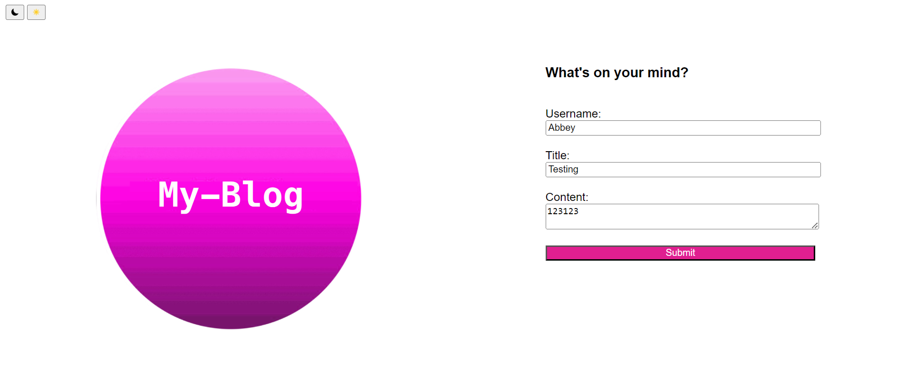

# my-blog

## Description

My motivation for this project was to create a webpage that could take in user data. It would allow users to make a blog post if they entered their username, a title for the post, and content for the post. Then it would store that data in local storage. It would allow users to make up to five posts before clearing local storage and starting over. Then it would output these posts on the next page in order from earliest to latest. It would also allow users to select light or dark mode by hitting an icon showing the sun for light mode or the moon for dark mode. It also has a back button so users can go back to the page where they put in their information and make a new post if they would like to. 

## Installation

N/A

## Usage

Upon opening the page there are three boxes to take in user input. They are labelled username, title, and content. The user can proceed to the next page only after they have typed something in each box and have clicked the submit button. From there they can view the post they just made and up to four other recent posts they have made. On the first page there are two icons at the top left corner. One has a moon and one has a sun. If they click the moon icon it will display the page in dark mode. In order to go back to light mode they can hit the sun icon. The next page also has these icons and they function in the same way, but they are in the bottom left instead.

Github Repository Link: https://github.com/arosswhich/my-blog
Deployed Website Link: https://arosswhich.github.io/my-blog/

## Credits

N/A
